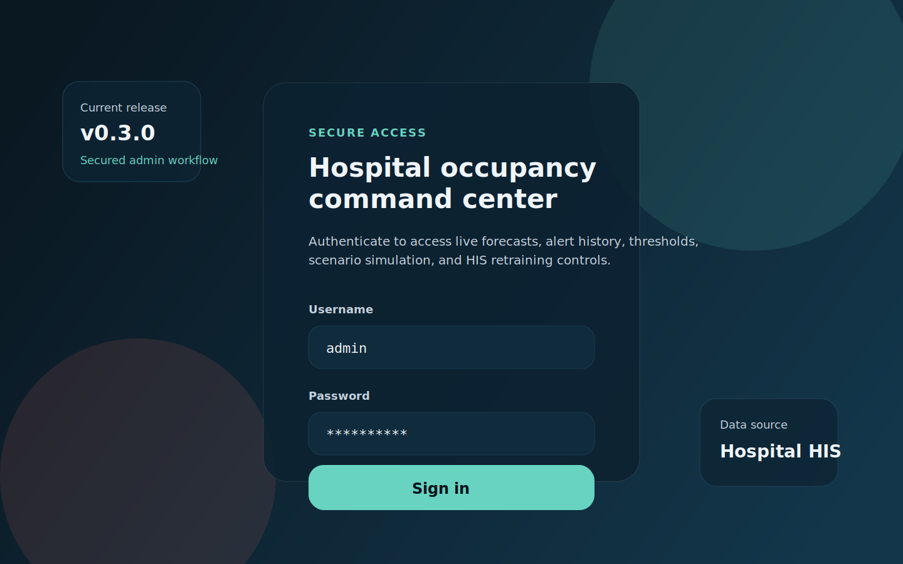
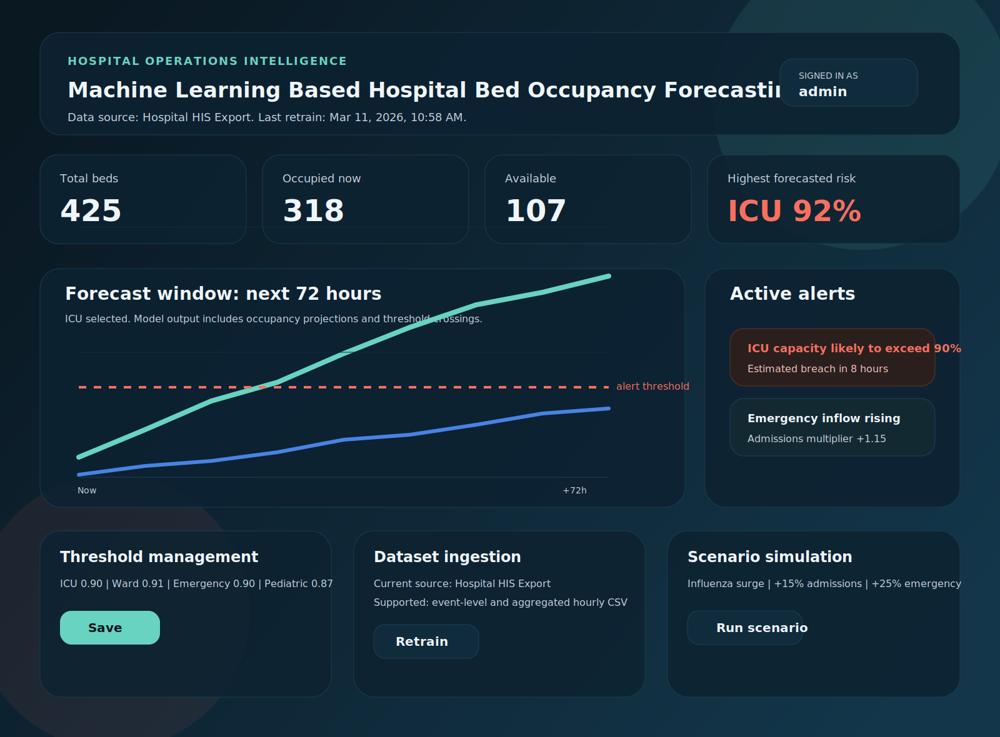
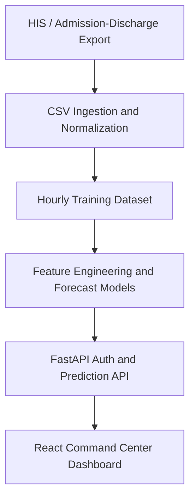

# Machine Learning Based Hospital Bed Occupancy Forecasting System

[](https://github.com/tapendra9104/ML-Model-for-Hospital-Bed-Occupancy-Forecast/actions/workflows/ci.yml)
[](https://github.com/tapendra9104/ML-Model-for-Hospital-Bed-Occupancy-Forecast/tags)
[](https://github.com/tapendra9104/ML-Model-for-Hospital-Bed-Occupancy-Forecast/commits/main)
[](https://github.com/tapendra9104/ML-Model-for-Hospital-Bed-Occupancy-Forecast)
[](https://github.com/tapendra9104/ML-Model-for-Hospital-Bed-Occupancy-Forecast)
[](https://fastapi.tiangolo.com/)
[](https://react.dev/)

Hospital operations decision-support platform that forecasts department-level bed occupancy from historical admissions and discharge activity, surfaces threshold alerts, and gives administrators a secured dashboard for monitoring, retraining, and scenario simulation.

## Screenshots

### Secure Login



### Operations Dashboard



## Features

- Forecasts ICU, ward, emergency, and pediatric occupancy for the next `6` to `168` hours.
- Ingests real HIS exports from event-level admission/discharge data or aggregated hourly occupancy files.
- Retrains models against hospital-specific patterns after dataset ingestion.
- Persists authentication, sessions, thresholds, alert history, scenarios, and dataset metadata in SQLite.
- Exposes FastAPI endpoints for dashboard views, forecasts, admin operations, and simulations.
- Uses a React dashboard with lazy-loaded charts and split frontend bundles.

## Tech Stack

- Backend: FastAPI, Pandas, NumPy, scikit-learn, SQLite
- Frontend: React, Vite, Recharts
- Testing: pytest
- CI: GitHub Actions

## Quick Start

### Backend

```powershell
python -m pip install -r backend\requirements.txt
uvicorn backend.app.main:app --reload --host 127.0.0.1 --port 8010
```

Optional environment variables:

```powershell
$env:HOSPITAL_ADMIN_USERNAME = "your-admin"
$env:HOSPITAL_ADMIN_PASSWORD = "strong-password"
$env:HOSPITAL_APP_DB_PATH = "C:\path\to\hospital_app.sqlite3"
$env:HOSPITAL_ACTIVITY_DATA_PATH = "C:\path\to\hospital_activity.csv"
$env:HOSPITAL_HIS_RAW_DATA_PATH = "C:\path\to\his_source.csv"
```

### Frontend

```powershell
cd frontend
npm install
$env:VITE_API_BASE_URL = "http://127.0.0.1:8010"
npm run dev
```

Open `http://127.0.0.1:5173`.

Default login:

```text
username: admin
password: admin123
```

## Architecture



## Supported HIS CSV Formats

### Event-level admission/discharge export

Required columns:

- `admission_time`
- `department`

Recommended columns:

- `discharge_time`
- `patient_id`
- `admission_type`

The backend converts these records into hourly admissions, discharges, emergency inflow, and occupancy counts.

### Aggregated hourly occupancy dataset

Required columns:

- `timestamp`
- `admissions`
- `discharges`
- `icu_occupied`
- `ward_occupied`
- `emergency_occupied`
- `pediatric_occupied`

Optional columns:

- `emergency_cases`
- `outbreak_signal`

Templates included in the repository:

- `backend/data/templates/his_event_template.csv`
- `backend/data/templates/his_aggregate_template.csv`

## Repository Layout

```text
backend/
  app/
  data/
  scripts/
  tests/
frontend/
  src/
postman/
docs/
  screenshots/
```

## API Summary

Public:

- `GET /health`
- `POST /api/auth/login`

Authenticated:

- `GET /api/auth/me`
- `POST /api/auth/logout`
- `GET /api/dashboard`
- `GET /api/overview`
- `GET /api/forecast/{department}`
- `GET /api/alerts`
- `GET /api/trends`

Admin:

- `PUT /api/admin/thresholds`
- `GET /api/admin/alerts/history`
- `POST /api/admin/scenarios`
- `POST /api/admin/scenarios/{id}/simulate`
- `POST /api/admin/datasets/ingest`
- `POST /api/admin/models/retrain`

Full request coverage is available in `postman/HospitalBedForecasting.postman_collection.json`.

## Seed Data

Generate multiple hospital-profile HIS exports and normalized hourly datasets:

```powershell
python backend\scripts\seed_hospital_datasets.py
```

Output profiles are written to `backend/data/seeds/`.

## Verification

```powershell
python -m pytest -q backend\tests
cd frontend
npm run build
```

## CI

GitHub Actions runs:

- backend dependency installation and `pytest`
- frontend dependency installation and production build

Workflow file: `.github/workflows/ci.yml`

## Release Notes

Current repository tag: `v0.3.0`

Detailed changes are recorded in [CHANGELOG.md](CHANGELOG.md).

## Notes

- The application seeds synthetic data only when no HIS dataset is available.
- Uploaded real HIS data becomes the active training source.
- Scenario simulations are intentionally non-destructive and do not persist hypothetical alerts into production alert history.
